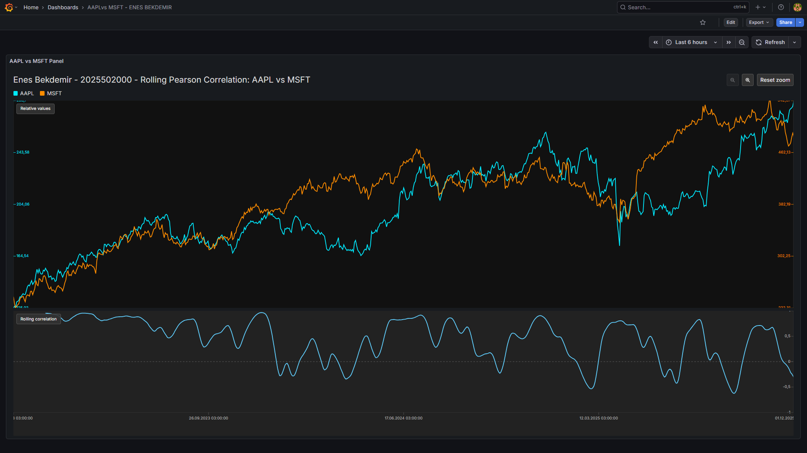

# Analytics Correlation Panel

I built a Grafana panel plugin to explore the Pearson correlation between any two or more numeric series directly inside a Grafana dashboard.



## What the panel delivers
- Accept multiple numeric series and a single time field, smooth the raw points, and compute a sliding Pearson correlation window by window.
- Render the aligned series together with the correlation trace so you can see how synchronously the assets move through time.
- Provide interactive hovering, zooming, and resizing so findings stay readable even on dense dashboards.
- Ship battle-tested CSV samples (`example_data/aapl_v1.csv` and `example_data/msft_v1.csv`) for immediate experimentation without wiring an external data source.
## How it was built
1. **Grafana panel skeleton** – Generated the standard panel plugin scaffold, implemented `CorrelationPanel.tsx`, and wired it through `src/module.ts` so Grafana can discover and render it like any built‑in visualization.
2. **Correlation utilities** – Implemented helpers in `src/utils/correlation.ts` to normalize timestamps, smooth noisy series, and calculate a rolling Pearson coefficient that reacts fluidly to the user’s window size option.
3. **Interactive canvas** – Crafted a lightweight SVG-based renderer with custom axis builders, brushing logic, and tooltip handling to avoid pulling heavy charting libraries while preserving a polished UX.


### Instructions
1. Install dependencies
   ```bash
   npm install
   ```

2. Build plugin in development mode and run in watch mode

   ```bash
   npm run dev
   ```

3. Spin up a Grafana instance and run the plugin inside it (using Docker)

   ```bash
   npm run server
   ```

3. Open http://localhost:3000, log in with the default Grafana credentials (`admin` / `admin`).

## Using the plugin inside Grafana
1. Create or open a dashboard and add a new panel.
2. Choose any time-series capable data source (TestData DB random walk also works).
3. Switch the visualization to **Analytics**.
4. Configure two queries that each return a numeric field and share a time field:
   - **CSV Content:** paste the contents of `example_data/aapl_v1.csv` into Query A and `example_data/msft_v1.csv` into Query B using the CSV Content scenario.
   - **Random Walk:** pick the *Random Walk* scenario twice to create two independent synthetic stocks.
5. Resize the panel so both the stacked lines and the correlation strip have enough vertical space.
6. Hover or click-drag to inspect precise timestamps, paired values, and the correlation coefficient for the currently selected window.

OR just copy the [./dashboard.json](./dashboard.json) and create an example dashboard.

## What I Implemented

**Core Functionality:**
- **Pearson Correlation Algorithm**: Implemented a custom correlation calculation in [src/utils/correlation.ts](src/utils/correlation.ts) that computes the Pearson coefficient across configurable time series (such as stocks history).
- **Series Smoothing**: Built a moving average smoother to reduce noise in raw time-series data while preserving trends, making correlation patterns more interpretable.
- **Cointegration Z-Score Analysis**: Added linear regression-based cointegration testing that computes normalized residuals, enabling statistical assessment of long-term relationships between series.

**Visualization:**
- **Custom SVG Renderer**: [src/CorrelationPanel.tsx](src/CorrelationPanel.tsx) renders multiple time series with proper scaling, axis generation, and path optimization.
- **Interactive Tooltips**: Implemented mouse tracking and hover states that display synchronized values across all series plus the instantaneous correlation coefficient at any point in time.
- **Zoom Interaction**: Created click-drag selection behavior allowing users to zoom in the data.
- **Responsive Layout**

Additionally:
- **Example Datasets**: Prepared real financial data samples (Apple and Microsoft stock prices) in [example_data/](example_data/) for immediate testing without external dependencies.
- **dashboard.json**

---

<h2 style="border:none">Enes Bekdemir</h2>